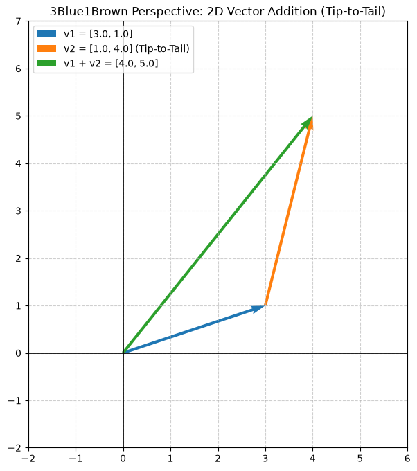

# 01. Vector Fundamentals & Pure Python Implementation

This module implements core linear algebra operations from first principles using standard Python data structures (`list[float]`) without relying on external numerical acceleration libraries like NumPy. It also includes a 2D geometric visualizer inspired by 3Blue1Brown's *Essence of Linear Algebra*.

---

## 📌 Implemented Core Concepts

### 1. Vector Addition (`vector_add`)

* **Mathematical Concept**: Component-wise sum of two equal-dimensional vectors $v_1, v_2 \in \mathbb{R}^n$.
* **Geometric View**: Tip-to-Tail addition where the tail of the second vector is positioned at the tip of the first.
* **Safety**: Includes strict dimension validation raising a `ValueError` on mismatched vector lengths.

$$\vec{v}_1 + \vec{v}_2 = \begin{bmatrix} v_{1,1} \\ v_{1,2} \end{bmatrix} + \begin{bmatrix} v_{2,1} \\ v_{2,2} \end{bmatrix} = \begin{bmatrix} v_{1,1} + v_{2,1} \\ v_{1,2} + v_{2,2} \end{bmatrix}$$

### 2. Dot Product (`dot_product`)

* **Mathematical Concept**: The sum of products of corresponding vector components, yielding a scalar output.
* **Geometric View**: Measures vector alignment, directional similarity, and geometric projection.

$$\vec{v}_1 \cdot \vec{v}_2 = \sum_{i=1}^{n} v_{1,i} v_{2,i}$$

### 3. Matrix Multiplication (`matrix_multiply`)

* **Algorithm**: Pure Python triple-nested loop algorithm calculating matrix composition $C = A \times B$.
* **Dimension Validation**: Enforces matrix compatibility where columns of $A$ ($m \times n$) must match rows of $B$ ($n \times p$).

$$C_{i,j} = \sum_{k=1}^{n} A_{i,k} \cdot B_{k,j}$$

### 4. 2D Vector Addition Visualizer (`visualization.py`)

* Renders 2D vectors on a Cartesian plane using `matplotlib.quiver`.
* Graphically illustrates the **Tip-to-Tail** addition property:
1. Base vector $\vec{v}_1$ originates from the origin $(0,0)$.
2. Second vector $\vec{v}_2$ originates at the tip of $\vec{v}_1$.
3. Resultant vector $\vec{v}_1 + \vec{v}_2$ spans directly from $(0,0)$ to the tip of $\vec{v}_2$.


---

## 📂 File Structure

```text
01-vector-fundamentals/
├── README.md               # Folder-level documentation and concept guide
├── matrix_from_scratch.py  # First-principles math implementations (pure Python)
└── visualization.py        # 2D Matplotlib vector visualizer

```

---

## 🚀 How to Run

### 1. Test Core Operations

Run `matrix_from_scratch.py` to execute built-in unit tests for vector addition, dot product, and matrix multiplication:

```bash
python matrix_from_scratch.py

```

**Output:**

```text
Dot Product: 32.0
Matrix Multiply: [[19.0, 22.0], [43.0, 50.0]]

```

### 2. Render Vector Visualization

Run `visualization.py` to display the interactive Matplotlib plot:

## 🖼️ Geometric Visualization

Here is the 2D Tip-to-Tail vector addition rendered using Matplotlib:



```bash
python visualization.py

```
