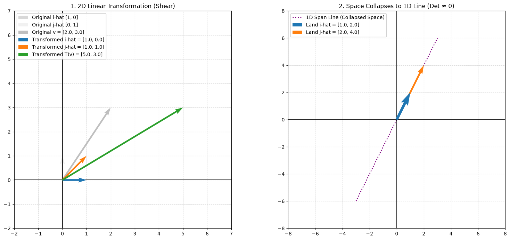

# 03. Linear Transformations & Matrices

This module explores core 2D linear transformations and matrix-vector multiplication implemented from first principles using standard Python data structures (`list[float]`) without external numerical computing libraries like NumPy. Inspired by 3Blue1Brown's *Essence of Linear Algebra*, it frames matrices as geometric transformations of space dictated by where basis vectors ($\hat{i}$ and $\hat{j}$) land.

---

## 📌 Implemented Core Concepts

### 1. Matrix-Vector Multiplication (`matrix_vector_multiply`)

* **Concept:** Computes $T(\vec{v}) = M \cdot \vec{v}$ by evaluating the linear combination of the transformed basis vectors.
* **Geometric View:** The columns of matrix $M$ represent where basis vectors $\hat{i}$ $[1, 0]$ and $\hat{j}$ $[0, 1]$ land after transformation. Scaling these landing sites by the vector's coordinates $(x, y)$ yields the transformed vector $T(\vec{v})$.
* **Formula:**

$$\begin{bmatrix} a & b \\ c & d \end{bmatrix} \begin{bmatrix} x \\ y \end{bmatrix} = x \begin{bmatrix} a \\ c \end{bmatrix} + y \begin{bmatrix} b \\ d \end{bmatrix} = \begin{bmatrix} ax + by \\ cx + dy \end{bmatrix}$$

---

### 2. Dimensionality Reduction Check (`check_dimensionality_reduction`)

* **Concept:** Determines if a 2D transformation collapses (squishes) 2D space down into a 1D line by calculating the 2D determinant.
* **Numerical Safety:** Uses a tolerance threshold ($\epsilon = 10^{-9}$) to prevent IEEE floating-point precision errors when evaluating zero determinants.
* **Formula:**

$$\det(M) = ad - bc$$

$$\text{If } \vert{}\det(M)\vert{} < 10^{-9} \implies \text{Space Collapses to 1D Span Line}$$

---

### 3. Transformation Generators

* **90° Counter-Clockwise Rotation (`get_rotation_90_ccw_matrix`):** 
  Rotates space by $90^\circ$ CCW.
  * $\hat{i}$ lands at $[0.0, 1.0]$ (Column 1)
  * $\hat{j}$ lands at $[-1.0, 0.0]$ (Column 2)

* **Horizontal Shear (`get_shear_horizontal_matrix`):** 
  Slants space horizontally.
  * $\hat{i}$ remains fixed at $[1.0, 0.0]$ (Column 1)
  * $\hat{j}$ shifts to $[1.0, 1.0]$ (Column 2)

---

### 4. 2D Side-by-Side Visualizer (`visualization.py`)

* **Subplot 1 (Linear Transformation):** Visualizes basis vector movement before and after transformation (e.g., Horizontal Shear), displaying original vectors in faded gray alongside new landing positions and the transformed output $T(\vec{v})$.
* **Subplot 2 (Space Collapse):** Displays how collinear columns ($\det(M) = 0$) squish all of 2D space onto a single 1D span line.
* Automatically saves rendered plots under `assets/linear_transformation.png`.

---

## 📂 File Structure

```text
03-linear-transformations-and-matrices/
├── assets/
│   └── linear_transformation.png  # Side-by-side rendered transformation plot
├── README.md                      # Documentation and conceptual guide
├── matrix_from_scratch.py         # Pure Python math implementations & tests
└── visualization.py               # Matplotlib side-by-side 2D visualizer


---

## 🚀 How to Run

### 1. Execute Core Operations & Test Cases

Run `matrix_from_scratch.py` to execute built-in unit tests for 2D transformations:

```bash
python matrix_from_scratch.py

```

**Expected Output:**

```text
Test 1 (90° CCW Rotation) : [-3.0, 2.0]
Test 2 (horizontal shear) : [5.0, 3.0]
Test 3 (Is Collapsed?)    : True
Test 4 (Is Collapsed?)    : False

```

### 2. Render Vector Visualization

Run `visualization.py` to display and export the interactive side-by-side plot:

```bash
python visualization.py

```

---

## 🖼️ Geometric Visualization

Here is the side-by-side comparison showing a Horizontal Shear transformation vs. a 1D Space Collapse:

